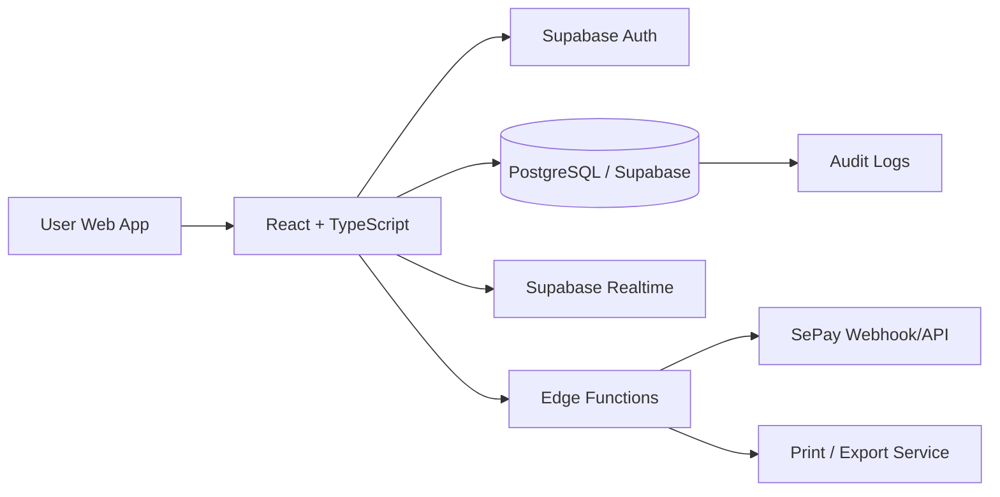
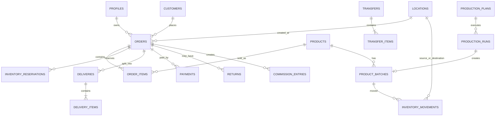
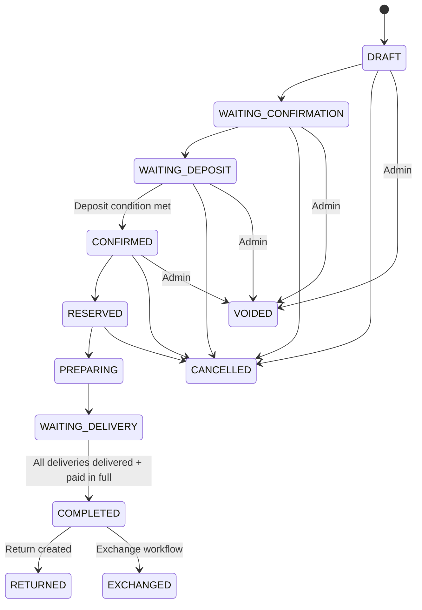
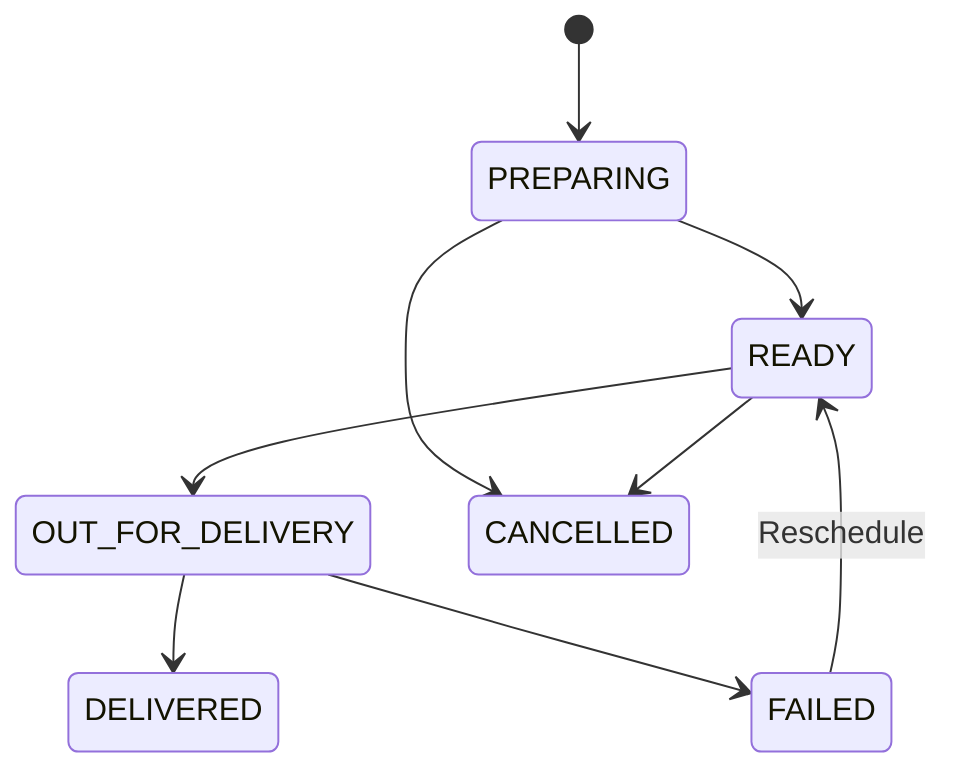
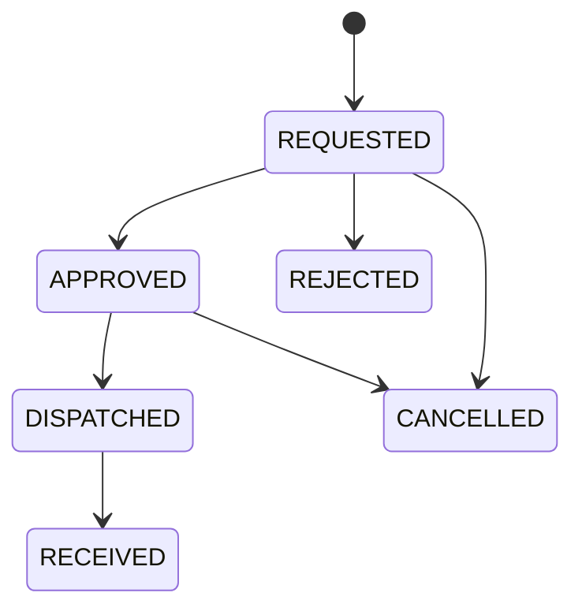
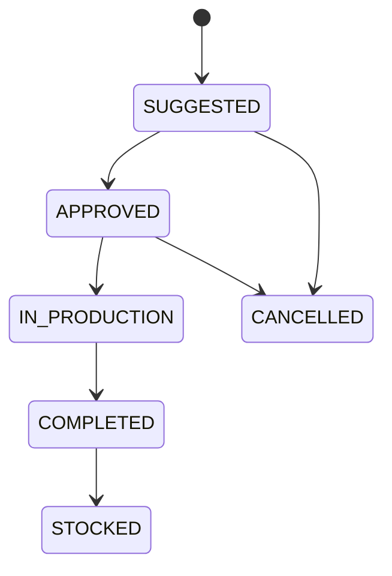
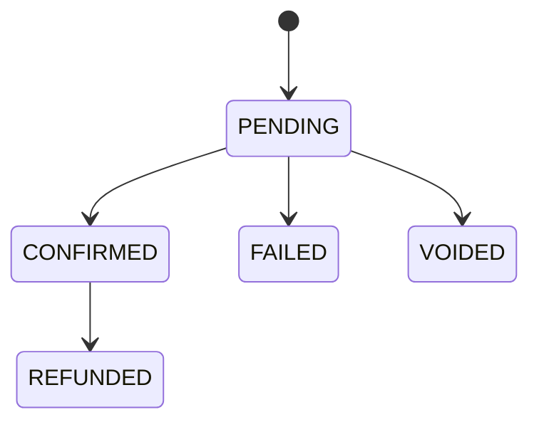
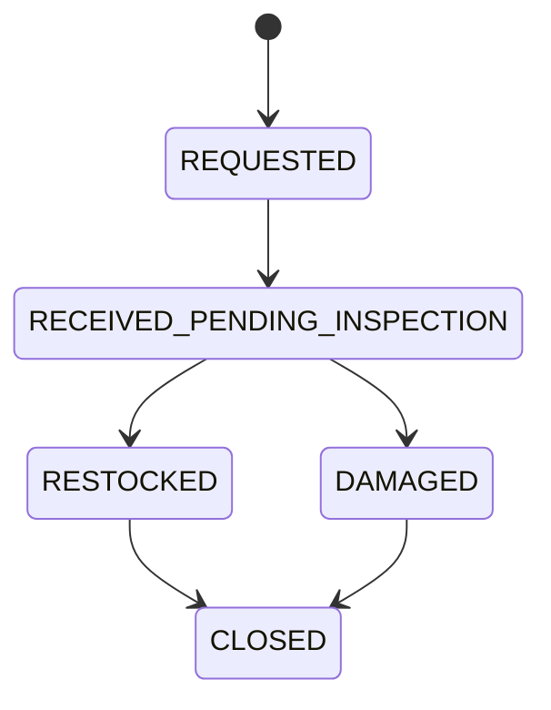
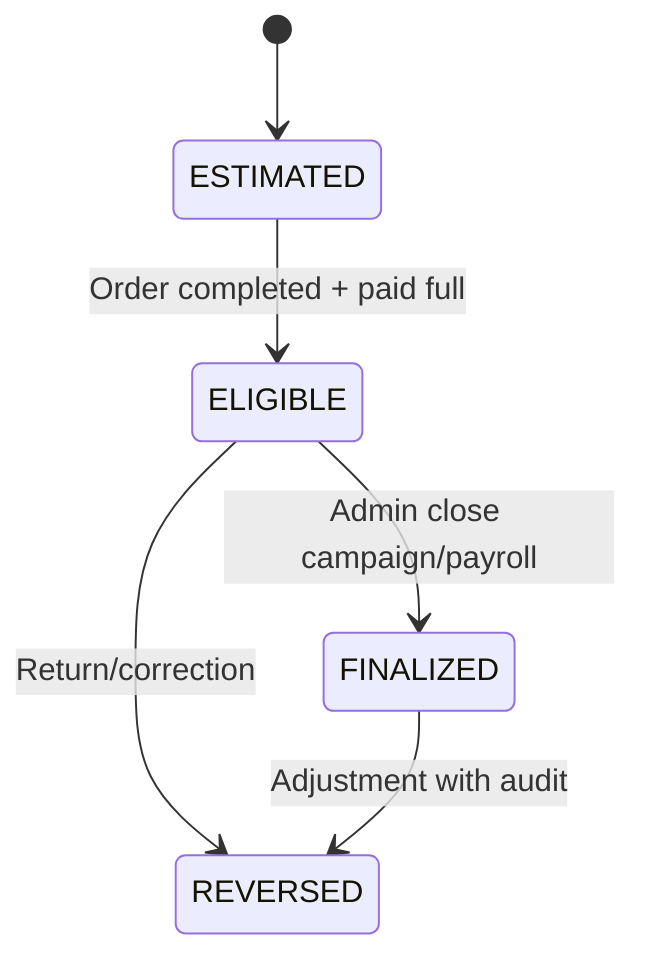

# CHB BÁNH CHƯNG TẾT 2027
## TECHNICAL DESIGN v1.0
### Database Schema + State Machine + Wireframe

**Căn cứ:** PRD v1.0 đã khóa  
**Mục tiêu:** Làm tài liệu đầu vào trực tiếp cho Codex / Claude Code / đội dev.

---

# 1. KIẾN TRÚC TỔNG THỂ



Nguyên tắc:

- Web app responsive, ưu tiên desktop + mobile browser.
- PostgreSQL là nguồn dữ liệu chính.
- Không cho client cập nhật tồn trực tiếp.
- Các nghiệp vụ tồn, thanh toán, chuyển trạng thái quan trọng chạy qua transaction/RPC/Edge Function.
- Audit mọi thay đổi có ảnh hưởng tiền, hàng, đơn, hoa hồng.

---

# 2. ROLE MODEL

## 2.1 Roles

```text
ADMIN
SALE_B2B
STORE_STAFF
FRANCHISE_STAFF
WAREHOUSE
PRODUCTION
```

## 2.2 Permission Matrix

| Chức năng | Admin | Sale B2B | Store | Franchise | Warehouse | Production |
|---|---:|---:|---:|---:|---:|---:|
| Tạo đơn | ✓ | ✓ | ✓ | ✓ |  |  |
| Xem đơn của mình | ✓ | ✓ | ✓ | ✓ |  |  |
| Xem mọi đơn | ✓ |  |  |  |  |  |
| Sửa giá/discount | ✓ | theo rule | theo rule | theo rule |  |  |
| Vô hiệu hóa đơn | ✓ |  |  |  |  |  |
| Xác nhận thanh toán | ✓ |  |  |  |  |  |
| Xem tồn toàn hệ thống | ✓ | ✓ | ✓ | ✓ | ✓ | ✓ |
| Điều chỉnh tồn | ✓ |  |  |  |  |  |
| Đề xuất điều chuyển | ✓ | ✓ | ✓ | ✓ | ✓ |  |
| Duyệt điều chuyển | ✓ |  |  |  |  |  |
| Xác nhận xuất/nhận transfer | ✓ |  |  |  | ✓ |  |
| Xem kế hoạch sản xuất | ✓ |  |  |  | ✓ | ✓ |
| Cập nhật sản xuất | ✓ |  |  |  |  | ✓ |
| Xem hoa hồng bản thân | ✓ | ✓ | ✓ | ✓ |  |  |
| Xem toàn bộ hoa hồng | ✓ |  |  |  |  |  |
| Settings | ✓ |  |  |  |  |  |
| Audit log | ✓ |  |  |  |  |  |

---

# 3. DATABASE SCHEMA

## 3.1 `profiles`

Liên kết 1:1 với Supabase Auth user.

| Field | Type | Rule |
|---|---|---|
| id | uuid PK | = auth.users.id |
| full_name | text | not null |
| phone | text | nullable |
| role_id | uuid FK | not null |
| default_location_id | uuid FK | nullable |
| default_sales_channel_id | uuid FK | nullable |
| default_lead_source_id | uuid FK | nullable |
| is_active | boolean | default true |
| created_at | timestamptz | default now |
| updated_at | timestamptz | default now |

Index:

- `role_id`
- `default_location_id`
- `is_active`

---

## 3.2 `roles`

| Field | Type |
|---|---|
| id | uuid PK |
| code | text unique |
| name | text |
| description | text |
| permissions | jsonb |
| created_at | timestamptz |

---

## 3.3 `locations`

Dùng chung cho bếp tổng, VP, cửa hàng CHB, franchise.

| Field | Type | Rule |
|---|---|---|
| id | uuid PK | |
| code | text unique | |
| name | text | not null |
| location_type | text | CENTRAL_KITCHEN / OFFICE / STORE / FRANCHISE |
| region | text | HN/HCM/... |
| address | text | |
| phone | text | |
| is_active | boolean | default true |
| created_at | timestamptz | |

---

## 3.4 `sales_channels`

| Field | Type |
|---|---|
| id | uuid PK |
| code | text unique |
| name | text |
| is_active | boolean |
| sort_order | int |

---

## 3.5 `lead_sources`

| Field | Type |
|---|---|
| id | uuid PK |
| code | text unique |
| name | text |
| is_active | boolean |
| sort_order | int |

---

## 3.6 `customers`

| Field | Type | Rule |
|---|---|---|
| id | uuid PK | |
| customer_type | text | INDIVIDUAL / COMPANY |
| name | text | |
| phone | text | |
| address | text | |
| company_name | text | |
| tax_code | text | |
| contact_name | text | |
| contact_title | text | |
| email | text | |
| company_address | text | |
| created_by | uuid FK profiles | |
| created_at | timestamptz | |
| updated_at | timestamptz | |
| is_archived | boolean | default false |

Không đặt unique constraint cho `phone` hoặc `tax_code`.

Index:

- normalized phone
- tax_code
- company_name

---

## 3.7 `products`

| Field | Type | Rule |
|---|---|---|
| id | uuid PK | |
| sku | text unique | |
| name | text | |
| category | text | |
| weight_gram | int | nullable |
| list_price | bigint | VND integer |
| default_commission_rate | numeric(5,2) | % |
| is_active | boolean | |
| created_at | timestamptz | |
| updated_at | timestamptz | |

---

## 3.8 `product_batches`

| Field | Type |
|---|---|
| id | uuid PK |
| batch_code | text |
| product_id | uuid FK |
| manufactured_date | date |
| expiry_date | date |
| production_run_id | uuid FK nullable |
| status | text |
| created_at | timestamptz |

Unique đề xuất:

`(product_id, batch_code)`

Index:

- `expiry_date`
- `product_id`

---

## 3.9 `orders`

| Field | Type | Rule |
|---|---|---|
| id | uuid PK | |
| order_code | text unique | |
| customer_id | uuid FK | |
| owner_user_id | uuid FK profiles | người phụ trách |
| created_by | uuid FK profiles | |
| creation_location_id | uuid FK locations | |
| sales_channel_id | uuid FK | |
| lead_source_id | uuid FK | |
| status | text | state machine |
| gross_amount | bigint | list price total |
| discount_amount | bigint | |
| net_amount | bigint | |
| deposit_required | bigint | |
| paid_amount | bigint | |
| remaining_amount | bigint | |
| requires_invoice | boolean | |
| notes | text | |
| reservation_expires_at | timestamptz | nullable |
| confirmed_at | timestamptz | |
| completed_at | timestamptz | |
| cancelled_at | timestamptz | |
| voided_at | timestamptz | |
| void_reason | text | |
| created_at | timestamptz | |
| updated_at | timestamptz | |

Check:

- `discount_amount >= 0`
- `net_amount = gross_amount - discount_amount`
- `paid_amount >= 0`
- `remaining_amount >= 0`

---

## 3.10 `order_items`

| Field | Type |
|---|---|
| id | uuid PK |
| order_id | uuid FK |
| product_id | uuid FK |
| quantity | int |
| list_price | bigint |
| gross_line_amount | bigint |
| allocated_quantity | int default 0 |
| delivered_quantity | int default 0 |
| returned_quantity | int default 0 |
| created_at | timestamptz |

Check:

- quantity > 0
- delivered_quantity <= quantity
- returned_quantity <= delivered_quantity

---

## 3.11 `inventory_movements`

**Nguồn sự thật của tồn kho.**

| Field | Type |
|---|---|
| id | uuid PK |
| movement_type | text |
| product_id | uuid FK |
| batch_id | uuid FK |
| from_location_id | uuid FK nullable |
| to_location_id | uuid FK nullable |
| quantity | int |
| order_id | uuid nullable |
| transfer_id | uuid nullable |
| return_id | uuid nullable |
| production_run_id | uuid nullable |
| reason | text |
| created_by | uuid FK |
| created_at | timestamptz |

Movement type:

```text
PRODUCTION_IN
SALE_OUT
TRANSFER_OUT
TRANSFER_IN
RETURN_IN
DAMAGE_OUT
SAMPLE_OUT
GIFT_OUT
ADJUSTMENT_IN
ADJUSTMENT_OUT
INSPECTION_TO_AVAILABLE
INSPECTION_TO_DAMAGED
```

---

## 3.12 `inventory_balances`

Materialized/cache table.

| Field | Type |
|---|---|
| id | uuid PK |
| location_id | uuid FK |
| product_id | uuid FK |
| batch_id | uuid FK |
| available_qty | int |
| reserved_qty | int |
| in_transfer_qty | int |
| pending_inspection_qty | int |
| damaged_qty | int |
| sample_qty | int |
| gift_qty | int |
| updated_at | timestamptz |

Unique:

`(location_id, product_id, batch_id)`

Không cập nhật từ client.

---

## 3.13 `inventory_reservations`

| Field | Type |
|---|---|
| id | uuid PK |
| order_id | uuid FK |
| order_item_id | uuid FK |
| location_id | uuid FK |
| product_id | uuid FK |
| batch_id | uuid FK |
| quantity | int |
| reservation_type | text |
| status | text |
| reserved_at | timestamptz |
| expires_at | timestamptz nullable |
| released_at | timestamptz nullable |
| release_reason | text nullable |

`reservation_type`:

- TEMPORARY
- PHYSICAL_ALLOCATION

`status`:

- ACTIVE
- CONSUMED
- RELEASED
- EXPIRED

---

## 3.14 `safety_stock_rules`

| Field | Type |
|---|---|
| id | uuid PK |
| location_id | uuid FK |
| product_id | uuid FK |
| minimum_qty | int |
| updated_by | uuid FK |
| updated_at | timestamptz |

Unique:

`(location_id, product_id)`

---

## 3.15 `transfers`

| Field | Type |
|---|---|
| id | uuid PK |
| transfer_code | text unique |
| requested_by | uuid FK |
| source_location_id | uuid FK |
| destination_location_id | uuid FK |
| status | text |
| approved_by | uuid nullable |
| approved_at | timestamptz nullable |
| dispatched_at | timestamptz nullable |
| received_at | timestamptz nullable |
| reason | text |
| created_at | timestamptz |

Status:

```text
REQUESTED
APPROVED
REJECTED
DISPATCHED
RECEIVED
CANCELLED
```

---

## 3.16 `transfer_items`

| Field | Type |
|---|---|
| id | uuid PK |
| transfer_id | uuid FK |
| product_id | uuid FK |
| batch_id | uuid FK |
| requested_qty | int |
| approved_qty | int |
| dispatched_qty | int |
| received_qty | int |

---

## 3.17 `production_plans`

| Field | Type |
|---|---|
| id | uuid PK |
| plan_date | date |
| product_id | uuid FK |
| target_location_id | uuid FK |
| committed_demand_qty | int |
| safety_stock_target | int |
| available_qty | int |
| scheduled_qty | int |
| suggested_qty | int |
| approved_qty | int |
| status | text |
| created_by | uuid FK |
| approved_by | uuid nullable |
| created_at | timestamptz |

Status:

- SUGGESTED
- APPROVED
- IN_PRODUCTION
- COMPLETED
- CANCELLED

---

## 3.18 `production_runs`

| Field | Type |
|---|---|
| id | uuid PK |
| production_plan_id | uuid FK |
| product_id | uuid FK |
| planned_qty | int |
| actual_qty | int |
| batch_code | text |
| manufactured_date | date |
| expiry_date | date |
| destination_location_id | uuid FK |
| status | text |
| started_at | timestamptz |
| completed_at | timestamptz |
| created_by | uuid FK |

---

## 3.19 `deliveries`

| Field | Type |
|---|---|
| id | uuid PK |
| delivery_code | text unique |
| order_id | uuid FK |
| scheduled_date | date |
| scheduled_time | time nullable |
| recipient_name | text |
| recipient_phone | text |
| delivery_address | text |
| source_location_id | uuid FK |
| delivery_method | text |
| shipping_fee | bigint |
| shipping_fee_payer | text |
| status | text |
| notes | text |
| created_at | timestamptz |
| delivered_at | timestamptz nullable |
| failed_reason | text nullable |

Status:

```text
PREPARING
READY
OUT_FOR_DELIVERY
DELIVERED
FAILED
CANCELLED
```

---

## 3.20 `delivery_items`

| Field | Type |
|---|---|
| id | uuid PK |
| delivery_id | uuid FK |
| order_item_id | uuid FK |
| product_id | uuid FK |
| quantity | int |
| batch_id | uuid nullable |

Constraint nghiệp vụ:

Tổng quantity các delivery item của cùng order item không vượt order_items.quantity.

---

## 3.21 `payments`

| Field | Type |
|---|---|
| id | uuid PK |
| order_id | uuid FK |
| payment_code | text unique |
| method | text |
| amount | bigint |
| status | text |
| provider | text nullable |
| provider_reference | text nullable |
| transfer_content | text nullable |
| paid_at | timestamptz nullable |
| confirmed_by | uuid nullable |
| created_at | timestamptz |

Method:

- CASH
- BANK_TRANSFER
- QR
- COD

Status:

- PENDING
- CONFIRMED
- FAILED
- REFUNDED
- VOIDED

Unique quan trọng:

`provider + provider_reference`

để webhook không ghi nhận trùng.

---

## 3.22 `commission_rules`

| Field | Type |
|---|---|
| id | uuid PK |
| user_id | uuid nullable |
| role_id | uuid nullable |
| product_id | uuid nullable |
| rate_percent | numeric(5,2) |
| effective_from | date |
| effective_to | date nullable |
| is_active | boolean |

Priority:

1. User + Product
2. User
3. Role + Product
4. Role
5. Product default

---

## 3.23 `commission_entries`

| Field | Type |
|---|---|
| id | uuid PK |
| order_id | uuid FK |
| user_id | uuid FK |
| commission_revenue | bigint |
| rate_percent | numeric(5,2) |
| base_commission | bigint |
| customer_discount_share | bigint |
| return_adjustment | bigint |
| final_commission | bigint |
| status | text |
| calculated_at | timestamptz |
| finalized_at | timestamptz nullable |

Status:

- ESTIMATED
- ELIGIBLE
- FINALIZED
- REVERSED

---

## 3.24 `returns`

| Field | Type |
|---|---|
| id | uuid PK |
| return_code | text unique |
| order_id | uuid FK |
| reason | text |
| status | text |
| created_by | uuid FK |
| inspected_by | uuid nullable |
| created_at | timestamptz |
| inspected_at | timestamptz nullable |

Status:

- REQUESTED
- RECEIVED_PENDING_INSPECTION
- RESTOCKED
- DAMAGED
- CLOSED

---

## 3.25 `return_items`

| Field | Type |
|---|---|
| id | uuid PK |
| return_id | uuid FK |
| order_item_id | uuid FK |
| product_id | uuid FK |
| batch_id | uuid nullable |
| quantity | int |
| inspection_result | text nullable |

---

## 3.26 `app_settings`

| Field | Type |
|---|---|
| id | uuid PK |
| key | text unique |
| value | jsonb |
| description | text |
| updated_by | uuid FK |
| updated_at | timestamptz |

Keys gợi ý:

```text
reservation_ttl_hours
allocation_lead_days
default_deposit_type
default_deposit_value
batch_expiry_alert_days
forecast_window_days
order_prefix
sepay_config
```

---

## 3.27 `audit_logs`

| Field | Type |
|---|---|
| id | uuid PK |
| actor_user_id | uuid FK |
| entity_type | text |
| entity_id | uuid |
| action | text |
| before_data | jsonb |
| after_data | jsonb |
| reason | text |
| created_at | timestamptz |

---

# 4. RELATIONSHIP MAP



---

# 5. TRANSACTION RULES

## 5.1 Không tồn âm

Mọi transaction xuất kho phải lock balance row.

Pseudo flow:

```text
BEGIN

SELECT balance FOR UPDATE

sellable =
available
- reserved
- safety_stock

IF requested > sellable
  ROLLBACK
  RETURN OUT_OF_STOCK

CREATE movement

UPDATE balance

COMMIT
```

---

## 5.2 FEFO Allocation

Query:

1. Chọn location
2. Chọn product
3. `expiry_date >= today`
4. `available_qty > 0`
5. ORDER BY `expiry_date ASC`, `manufactured_date ASC`

Phân bổ nhiều batch nếu batch đầu không đủ.

---

## 5.3 Reservation Expiry

Scheduled job:

```text
WHERE
reservation_type = TEMPORARY
AND status = ACTIVE
AND expires_at <= now()
```

Action:

- release reservation
- giảm reserved_qty
- tăng sellable
- ghi audit
- nếu order vẫn chưa cọc → giữ order ở `WAITING_DEPOSIT`

---

# 6. ORDER STATE MACHINE



## 6.1 DRAFT

Cho phép:

- sửa customer
- sửa product
- sửa quantity
- sửa source/channel
- xóa item

Chưa ghi nhận doanh số chính thức.

## 6.2 WAITING_CONFIRMATION

Đơn đã submit.

Cho phép:

- Admin xác nhận
- quay lại Draft nếu chưa cọc

## 6.3 WAITING_DEPOSIT

- Có reservation tạm nếu còn TTL
- Hiển thị QR
- Countdown

Transition `CONFIRMED` khi thỏa chính sách cọc.

## 6.4 CONFIRMED

- Không cho sửa quantity
- Được tính future committed demand
- Nếu cần sửa → cancel + new order

## 6.5 RESERVED

- Đã physical allocation
- Đã có batch/location reservation thật

## 6.6 PREPARING

- Kho đang pick hàng
- In phiếu xuất

## 6.7 WAITING_DELIVERY

- Ít nhất một delivery đang chờ giao
- Có thể nhiều delivery khác nhau

## 6.8 COMPLETED

Điều kiện:

- Tất cả delivery bắt buộc đã DELIVERED
- Remaining Amount = 0
- Không còn pending item

Hành động:

- commission → ELIGIBLE

## 6.9 CANCELLED

- release reservation
- giữ audit
- không hard delete

## 6.10 VOIDED

Chỉ Admin.

Bắt buộc reason.

---

# 7. DELIVERY STATE MACHINE



Rule:

- `DELIVERED` → tạo `SALE_OUT` nếu chưa ghi nhận.
- `FAILED` → không tự trả tồn; hàng vẫn theo trạng thái logistics cho tới khi kho nhận lại.
- Reschedule được tạo lịch mới hoặc cập nhật lịch cùng delivery tùy chính sách vận hành.

---

# 8. TRANSFER STATE MACHINE



## Khi DISPATCHED

- nguồn: `TRANSFER_OUT`
- tăng `in_transfer_qty` ở logic transit

## Khi RECEIVED

- đích: `TRANSFER_IN`
- giảm transit

Franchise vẫn là location nội bộ của inventory system.

---

# 9. PRODUCTION STATE MACHINE



`STOCKED`:

- tạo Batch
- tạo `PRODUCTION_IN`
- cập nhật inventory balance

---

# 10. PAYMENT STATE MACHINE



Order Payment Summary:

```text
paid_amount = SUM(CONFIRMED payments) - SUM(refunds)
remaining_amount = net_amount - paid_amount
```

---

# 11. RETURN STATE MACHINE



Khi nhận hàng:

- đưa `pending_inspection_qty`

Nếu RESTOCKED:

- `INSPECTION_TO_AVAILABLE`

Nếu DAMAGED:

- `INSPECTION_TO_DAMAGED`

---

# 12. COMMISSION STATE MACHINE



---

# 13. DASHBOARD CALCULATION DEFINITIONS

## Gross Sales

```text
SUM(order.gross_amount)
WHERE status not in CANCELLED, VOIDED
```

## Net Sales

```text
SUM(order.net_amount)
WHERE status not in CANCELLED, VOIDED
```

## Cash Collected

```text
SUM(CONFIRMED payments)
```

## Units Sold

```text
SUM(order_items.quantity - returned_quantity)
WHERE order status not CANCELLED, VOIDED
```

## Sellable Inventory

```text
available_qty
- reserved_qty
- safety_stock
```

## Days of Stock

```text
sellable_inventory / average_daily_demand
```

---

# 14. WIREFRAME — GLOBAL DESIGN

## Desktop

```text
┌──────────────────────────────────────────────────────────────┐
│ CHB TẾT 2027              [Search]       [User] [Logout]     │
├──────────────┬───────────────────────────────────────────────┤
│ Sidebar      │ Main Content                                  │
│              │                                               │
│ Dashboard    │                                               │
│ Orders       │                                               │
│ Inventory    │                                               │
│ Delivery     │                                               │
│ ...          │                                               │
└──────────────┴───────────────────────────────────────────────┘
```

## Mobile

Bottom navigation cho user thường:

```text
[Trang chủ] [Tạo đơn] [Đơn] [Tồn] [Lịch giao]
```

Admin mobile có thể dùng hamburger menu.

---

# 15. WIREFRAME 01 — LOGIN

```text
┌──────────────────────────────────────┐
│              CHB FOOD                │
│          BÁNH CHƯNG TẾT 2027         │
│                                      │
│  Email / SĐT                         │
│  [____________________________]      │
│                                      │
│  Mật khẩu                            │
│  [____________________________]      │
│                                      │
│  [          ĐĂNG NHẬP          ]     │
│                                      │
└──────────────────────────────────────┘
```

---

# 16. WIREFRAME 02 — USER HOME

```text
┌───────────────────────────────────────────────────────────┐
│ Xin chào, Nguyễn Văn A                    15/01/2027      │
├───────────────────────────────────────────────────────────┤
│ [Doanh số tôi] [Đơn hôm nay] [Chờ cọc] [HH dự kiến]      │
│  82.5tr          14             6          9.2tr          │
├───────────────────────────────────────────────────────────┤
│                [+ TẠO ĐƠN MỚI]                            │
├───────────────────────────────────────────────────────────┤
│ Việc cần xử lý                                            │
│ • 3 đơn sắp hết thời gian giữ hàng                        │
│ • 2 đơn giao ngày mai chưa đủ tồn                         │
│ • 1 đơn COD chưa hoàn tất                                 │
└───────────────────────────────────────────────────────────┘
```

---

# 17. WIREFRAME 03 — CREATE ORDER

Một màn hình duy nhất.

```text
┌────────────────────────────────────────────────────────────┐
│ TẠO ĐƠN MỚI                              [Lưu nháp]        │
├────────────────────────────────────────────────────────────┤
│ KHÁCH HÀNG                                                 │
│ SĐT [___________]  [Tìm]                                  │
│ Tên [____________________________]                         │
│ Địa chỉ [____________________________________________]     │
│ Loại khách: (• Cá nhân) ( Doanh nghiệp )                  │
├────────────────────────────────────────────────────────────┤
│ NGUỒN ĐƠN                                                  │
│ Kênh bán [Online ▼]    Nguồn [Facebook ▼]                 │
│ Sale [Nguyễn A]        Điểm tạo [VP Minh Khai ▼]          │
├────────────────────────────────────────────────────────────┤
│ SẢN PHẨM                                                   │
│ SKU                 SL      Giá       Thành tiền           │
│ Truyền thống 1.2kg  [- 10 +] 140k      1,400,000          │
│ Cốm non 1.2kg       [-  5 +] 150k        750,000          │
│ [+ Thêm sản phẩm]                                          │
├────────────────────────────────────────────────────────────┤
│ DOANH SỐ                         2,150,000                  │
│ Hoa hồng tối đa 20%                430,000                  │
│ Chiết khấu khách     [       100,000 ]                     │
│ Hoa hồng còn lại                  330,000                  │
│ KHÁCH THANH TOÁN                2,050,000                  │
├────────────────────────────────────────────────────────────┤
│ GIAO HÀNG                                                  │
│ [Đợt 1] 20/01 | 10 bánh | VP Minh Khai                   │
│ [Đợt 2] 24/01 | 5 bánh  | Store A                        │
│ [+ THÊM ĐỢT GIAO]                                         │
├────────────────────────────────────────────────────────────┤
│ Tiền cọc yêu cầu                  615,000                  │
│ [QR PAYMENT]                    Còn 23:51:22 giữ hàng      │
│                                                            │
│ [HỦY]                     [XÁC NHẬN TẠO ĐƠN]              │
└────────────────────────────────────────────────────────────┘
```

Validation real-time:

- Discount không vượt commission.
- Delivery total không vượt order qty.
- Cảnh báo stock.
- Gợi ý location khác nếu thiếu.

---

# 18. WIREFRAME 04 — CUSTOMER DUPLICATE SUGGESTION

Popup:

```text
┌──────────────────────────────────────────────┐
│ Có khách hàng tương tự                      │
├──────────────────────────────────────────────┤
│ Nguyễn Văn B                                │
│ 090xxxxxxx                                  │
│ 12 Nguyễn Trãi, Hà Nội                     │
│ 3 đơn trước | 4.8 triệu                    │
│                                              │
│ [Dùng khách này]   [Vẫn tạo khách mới]     │
└──────────────────────────────────────────────┘
```

---

# 19. WIREFRAME 05 — MY ORDERS / ORDER LIST

```text
┌──────────────────────────────────────────────────────────────┐
│ ĐƠN HÀNG CỦA TÔI                     [+ Tạo đơn]             │
├──────────────────────────────────────────────────────────────┤
│ [Tìm mã/SĐT] [Trạng thái ▼] [Ngày ▼] [Kênh ▼]              │
├──────────────────────────────────────────────────────────────┤
│ #TET-1021 | Nguyễn A | 2.05tr | CHỜ CỌC | còn 12h           │
│ #TET-1020 | ABC JSC  | 18.5tr | ĐÃ XÁC NHẬN | Giao 20/01   │
│ #TET-1019 | Chị Lan  | 1.4tr  | HOÀN THÀNH                  │
└──────────────────────────────────────────────────────────────┘
```

---

# 20. WIREFRAME 06 — ORDER DETAIL

```text
┌──────────────────────────────────────────────────────────────┐
│ #TET-1020                  [ĐÃ XÁC NHẬN]                    │
│ ABC JSC                                                    │
├───────────────────────────────┬──────────────────────────────┤
│ Thông tin đơn                │ Thanh toán                  │
│ Sale: Nguyễn A               │ Tổng: 18,500,000            │
│ Kênh: B2B                    │ Đã thu: 5,550,000           │
│ Nguồn: DN                    │ Còn: 12,950,000             │
│                              │ [Xem QR]                    │
├───────────────────────────────┴──────────────────────────────┤
│ Sản phẩm                                                     │
│ ...                                                          │
├──────────────────────────────────────────────────────────────┤
│ Đợt giao                                                     │
│ 20/01 | 100 bánh | VP | READY                               │
│ 22/01 | 150 bánh | VP | PREPARING                           │
│ 24/01 | 250 bánh | Store A | PREPARING                      │
├──────────────────────────────────────────────────────────────┤
│ Timeline / Audit mini                                        │
│ 12:05 Created by Nguyễn A                                   │
│ 12:10 QR generated                                          │
│ 12:15 Payment confirmed 5,550,000                           │
└──────────────────────────────────────────────────────────────┘
```

Admin thêm action:

- Vô hiệu hóa
- Điều chỉnh payment
- Override warehouse/batch
- Print

---

# 21. WIREFRAME 07 — INVENTORY USER

```text
┌──────────────────────────────────────────────────────────────┐
│ TỒN KHO TOÀN HỆ THỐNG                                      │
├──────────────────────────────────────────────────────────────┤
│ [SKU ▼] [Khu vực ▼] [Kho ▼]                                │
├──────────────────────────────────────────────────────────────┤
│ SKU                  Kho          Có thể bán  Giữ   Safe     │
│ Truyền thống 1.2     VP Minh Khai     150       40    50     │
│ Truyền thống 1.2     Store A           25       10    20     │
│ Cốm non 1.2          VP Minh Khai      80       15    30     │
├──────────────────────────────────────────────────────────────┤
│ [Yêu cầu điều chuyển]                                       │
└──────────────────────────────────────────────────────────────┘
```

---

# 22. WIREFRAME 08 — INVENTORY ADMIN DETAIL

```text
┌──────────────────────────────────────────────────────────────┐
│ INVENTORY — VP MINH KHAI                                    │
├──────────────────────────────────────────────────────────────┤
│ SKU Truyền thống 1.2kg                                      │
│ Available 240 | Reserved 40 | Safe 50 | Sellable 150       │
├──────────────────────────────────────────────────────────────┤
│ Batch       NSX       HSD       Available   Reserved         │
│ BC0101      01/01     01/07        100          20           │
│ BC0201      02/01     02/07        140          20           │
├──────────────────────────────────────────────────────────────┤
│ [Điều chỉnh tồn] [Import] [Export] [Xem movement]           │
└──────────────────────────────────────────────────────────────┘
```

---

# 23. WIREFRAME 09 — TRANSFER REQUEST

```text
┌──────────────────────────────────────────────────────────────┐
│ YÊU CẦU ĐIỀU CHUYỂN                                        │
├──────────────────────────────────────────────────────────────┤
│ Kho cần hàng: Store A                                       │
│ SKU: Truyền thống 1.2kg                                     │
│ Số lượng cần: [30]                                          │
├──────────────────────────────────────────────────────────────┤
│ HỆ THỐNG ĐỀ XUẤT                                           │
│ 1. VP Minh Khai      Sellable 150   → chuyển 30            │
│ 2. Store B           Sellable  60   → chuyển 30            │
│                                                              │
│ [Chọn VP Minh Khai]                                         │
│                                                              │
│ [GỬI YÊU CẦU]                                               │
└──────────────────────────────────────────────────────────────┘
```

---

# 24. WIREFRAME 10 — ADMIN TRANSFER APPROVAL

```text
┌──────────────────────────────────────────────────────────────┐
│ ĐIỀU CHUYỂN CHỜ DUYỆT                                      │
├──────────────────────────────────────────────────────────────┤
│ TR-0012 | Store A ← VP Minh Khai                            │
│ Truyền thống 1.2kg | 30                                    │
│ Người yêu cầu: Nguyễn A                                     │
│                                                              │
│ [Từ chối]                         [DUYỆT]                    │
└──────────────────────────────────────────────────────────────┘
```

---

# 25. WIREFRAME 11 — DELIVERY CALENDAR

```text
┌──────────────────────────────────────────────────────────────┐
│ LỊCH GIAO HÀNG                                              │
│ [Hôm nay] [Ngày mai] [7 ngày] [Calendar]                   │
├──────────────────────────────────────────────────────────────┤
│ 09:00 #1020 ABC JSC       100 bánh  VP      READY           │
│ 10:30 #1028 Chị Mai        20 bánh  Store A OUT_FOR_DELIVERY│
│ 14:00 #1031 XYZ Co.       250 bánh  VP      PREPARING       │
├──────────────────────────────────────────────────────────────┤
│ Cảnh báo: 2 đợt giao ngày mai chưa đủ hàng                 │
└──────────────────────────────────────────────────────────────┘
```

---

# 26. WIREFRAME 12 — DELIVERY DETAIL

```text
┌──────────────────────────────────────────────────────────────┐
│ DELIVERY #DL-1020-01                                        │
├──────────────────────────────────────────────────────────────┤
│ 20/01/2027 09:00                                           │
│ ABC JSC                                                     │
│ 25 Hoàng Quốc Việt, Hà Nội                                  │
│ 090xxxxxxx                                                  │
│                                                              │
│ Kho xuất: VP Minh Khai                                      │
│ Hình thức: Ship ngoài                                       │
│ Phí ship: 85,000 | Khách trả                               │
├──────────────────────────────────────────────────────────────┤
│ Items                                                        │
│ Traditional 1.2kg | 100                                    │
├──────────────────────────────────────────────────────────────┤
│ [In phiếu giao] [In phiếu xuất]                            │
│ [Chờ giao ▼]                                                │
└──────────────────────────────────────────────────────────────┘
```

---

# 27. WIREFRAME 13 — PRODUCTION DASHBOARD

```text
┌──────────────────────────────────────────────────────────────┐
│ KẾ HOẠCH SẢN XUẤT                                          │
│ [Ngày 18/01 ▼]                                             │
├──────────────────────────────────────────────────────────────┤
│ SKU        Demand  Safe  Available Scheduled  Need          │
│ TT 1.2kg     800    200      300       100      600         │
│ Cốm 1.2kg    350    100      180        50      220         │
├──────────────────────────────────────────────────────────────┤
│ TT 1.2kg → [DUYỆT SX 600]                                  │
│ Cốm 1.2kg → [DUYỆT SX 220]                                 │
└──────────────────────────────────────────────────────────────┘
```

---

# 28. WIREFRAME 14 — PRODUCTION RUN

```text
┌──────────────────────────────────────────────────────────────┐
│ PRODUCTION RUN #PR-0008                                    │
├──────────────────────────────────────────────────────────────┤
│ SKU: Truyền thống 1.2kg                                    │
│ Kế hoạch: 600                                               │
│ Thực tế: [590]                                              │
│ Batch: [BC1801]                                             │
│ NSX: [18/01/2027]                                          │
│ HSD: [18/07/2027]                                          │
│ Nhập kho: [Bếp tổng HN ▼]                                  │
│                                                              │
│ [HOÀN THÀNH & NHẬP KHO]                                    │
└──────────────────────────────────────────────────────────────┘
```

---

# 29. WIREFRAME 15 — PAYMENT

```text
┌──────────────────────────────────────────────────────────────┐
│ THANH TOÁN #TET-1020                                       │
├──────────────────────────────────────────────────────────────┤
│ Tổng đơn:         18,500,000                               │
│ Cọc yêu cầu:       5,550,000                               │
│ Đã thu:            5,550,000                               │
│ Còn lại:          12,950,000                               │
├──────────────────────────────────────────────────────────────┤
│ [ QR CODE ]                                                  │
│ Nội dung: TET1020                                           │
├──────────────────────────────────────────────────────────────┤
│ 15/01 12:15 | QR | 5,550,000 | CONFIRMED                  │
│                                                              │
│ [+ Ghi nhận thanh toán]                                     │
└──────────────────────────────────────────────────────────────┘
```

---

# 30. WIREFRAME 16 — COMMISSION USER

```text
┌──────────────────────────────────────────────────────────────┐
│ HOA HỒNG CỦA TÔI                                           │
├──────────────────────────────────────────────────────────────┤
│ Doanh số gross         82,500,000                           │
│ Hoa hồng gốc           16,500,000                           │
│ Đã giảm cho khách       7,300,000                           │
│ Hoàn/đổi điều chỉnh       250,000                           │
│ HOA HỒNG DỰ KIẾN         8,950,000                          │
├──────────────────────────────────────────────────────────────┤
│ #1020  Gross 18.5m | HH 3.7m | Discount 1.2m | 2.5m       │
│ #1019  Gross  1.4m | HH 0.28m| Discount 0     | 0.28m     │
└──────────────────────────────────────────────────────────────┘
```

---

# 31. WIREFRAME 17 — ADMIN DASHBOARD

```text
┌────────────────────────────────────────────────────────────────┐
│ DASHBOARD CHIẾN DỊCH TẾT                                      │
├────────────────────────────────────────────────────────────────┤
│ Tổng đơn | Gross Sales | Cash | Units | Reserved | Sellable    │
│   1,245     3.82 tỷ     2.94t  22,840   5,300      8,450       │
├────────────────────────────────────────────────────────────────┤
│ ALERT                                                         │
│ 🔴 TT 1.2kg dự kiến thiếu 600 trong 3 ngày                    │
│ 🟠 12 đơn ngày mai chưa đủ allocation                         │
│ 🟠 8 đơn chờ cọc sắp hết TTL                                  │
├────────────────────────────────────────────────────────────────┤
│ Doanh số theo kênh     | Doanh số theo sale                  │
│ [chart]                | [chart]                              │
├────────────────────────────────────────────────────────────────┤
│ Giao hôm nay: 84 | Ngày mai: 112 | 7 ngày: 530               │
└────────────────────────────────────────────────────────────────┘
```

---

# 32. WIREFRAME 18 — ADMIN ORDERS

```text
┌──────────────────────────────────────────────────────────────┐
│ TOÀN BỘ ĐƠN HÀNG                                            │
├──────────────────────────────────────────────────────────────┤
│ Search | Status | Sale | Location | Channel | Date          │
├──────────────────────────────────────────────────────────────┤
│ Code | Customer | Sale | Gross | Paid | Status | Delivery   │
│ ...                                                          │
├──────────────────────────────────────────────────────────────┤
│ [Export Excel]                                               │
└──────────────────────────────────────────────────────────────┘
```

---

# 33. WIREFRAME 19 — CUSTOMER LIST

```text
┌──────────────────────────────────────────────────────────────┐
│ KHÁCH HÀNG                                                  │
├──────────────────────────────────────────────────────────────┤
│ [Tìm tên/SĐT/MST] [Cá nhân/DN ▼]                           │
├──────────────────────────────────────────────────────────────┤
│ Nguyễn A   090...   3 đơn   4.8m                            │
│ ABC JSC    010...   5 đơn  88.2m                            │
└──────────────────────────────────────────────────────────────┘
```

---

# 34. WIREFRAME 20 — REPORT

```text
┌──────────────────────────────────────────────────────────────┐
│ BÁO CÁO                                                     │
├──────────────────────────────────────────────────────────────┤
│ [Doanh số] [Kênh] [Nguồn] [Sale] [SKU] [Kho] [Customer]   │
├──────────────────────────────────────────────────────────────┤
│ Date range [____] → [____]                                  │
│ Location [All ▼]                                            │
│                                                              │
│ [Biểu đồ / bảng]                                             │
│                                                              │
│ [EXPORT EXCEL]                                               │
└──────────────────────────────────────────────────────────────┘
```

---

# 35. WIREFRAME 21 — MASTER DATA

Tabs:

```text
Sản phẩm
Kho/Cơ sở
Kênh bán
Nguồn khách
User
Commission Rule
Safety Stock
```

Ví dụ Products:

```text
┌──────────────────────────────────────────────────────────────┐
│ SẢN PHẨM                                   [+ Thêm SKU]     │
├──────────────────────────────────────────────────────────────┤
│ SKU | Tên | Giá | Hoa hồng | Active                        │
│ ...                                                          │
└──────────────────────────────────────────────────────────────┘
```

---

# 36. WIREFRAME 22 — SETTINGS

```text
┌──────────────────────────────────────────────────────────────┐
│ SETTINGS                                                    │
├──────────────────────────────────────────────────────────────┤
│ Reservation TTL            [24] giờ                         │
│ Allocation Lead Time       [5] ngày                         │
│ Deposit Type               [% ▼]                            │
│ Deposit Value              [30]                             │
│ Batch Expiry Alert         [30] ngày                        │
│ Forecast Window            [7] ngày                         │
│ Order Prefix               [TET]                            │
│                                                              │
│ [LƯU CẤU HÌNH]                                              │
└──────────────────────────────────────────────────────────────┘
```

---

# 37. WIREFRAME 23 — AUDIT LOG

```text
┌──────────────────────────────────────────────────────────────┐
│ AUDIT LOG                                                   │
├──────────────────────────────────────────────────────────────┤
│ User | Entity | Action | Time | Reason                     │
│ Admin | Order #1020 | VOID | 15:22 | Khách tạo trùng       │
│ Admin | Stock VP    | ADJUST +5 | 15:28 | Kiểm kê thực tế  │
├──────────────────────────────────────────────────────────────┤
│ [Xem before/after JSON]                                     │
└──────────────────────────────────────────────────────────────┘
```

---

# 38. PRINT DOCUMENTS

V1 cần 4 template:

1. Đơn hàng
2. Phiếu xuất kho
3. Phiếu giao hàng
4. Phiếu điều chuyển

Print từ HTML → browser print/PDF.

Không cần xây PDF engine phức tạp ở V1.

---

# 39. API / SERVICE BOUNDARIES

Các service logic nên tách:

```text
OrderService
InventoryService
ReservationService
AllocationService
TransferService
ProductionService
PaymentService
DeliveryService
CommissionService
AuditService
ReportingService
```

Không để component React chứa business logic quan trọng.

---

# 40. RPC / TRANSACTION FUNCTIONS NÊN CÓ

## `create_order_transaction()`

- Validate customer
- Validate items
- Snapshot list price
- Calculate commission ceiling
- Validate discount
- Create order/items
- Create temporary reservation nếu cần
- Return order code

## `confirm_payment()`

- Idempotency check
- Insert payment
- Update order paid/remaining
- Determine deposit condition
- Transition status

## `allocate_order_inventory()`

- FEFO
- Safety stock check
- Row lock
- Create physical reservations

## `dispatch_delivery()`

- Validate reservation
- Consume reserved inventory
- Create SALE_OUT

## `approve_transfer()`

- Check source sellable stock
- Allocate batches

## `complete_production_run()`

- Create batch
- Create production movement
- Update balance

## `process_return_inspection()`

- pending inspection → available/damaged

---

# 41. RLS NGUYÊN TẮC

User thường:

- Có thể SELECT inventory summary.
- Chỉ SELECT orders mình sở hữu hoặc do mình tạo.
- Chỉ UPDATE đơn khi còn trạng thái cho phép.
- Không UPDATE inventory movement/balance.
- Không SELECT commission người khác.

Admin:

- Toàn quyền nghiệp vụ qua app.
- Transaction table vẫn ưu tiên RPC thay vì update trực tiếp.

Warehouse/Production:

- Chỉ xem/chỉnh module thuộc vai trò.

---

# 42. REALTIME SUBSCRIPTIONS

Nên realtime:

- Inventory balance
- Order status
- Payment status
- Transfer status
- Delivery status

Không cần realtime:

- Report lịch sử
- Audit log
- Customer list

---

# 43. ALERT ENGINE

Các alert V1:

## Inventory shortage

```text
future_committed + safety_stock > available + scheduled_production
```

## Reservation expiry

`expires_at - now <= threshold`

## Delivery stock risk

Delivery trong X ngày nhưng chưa đủ physical allocation.

## Payment risk

Delivery gần tới nhưng `remaining_amount > 0`.

## Expiry risk

Batch expiry <= Admin setting.

---

# 44. SEARCH & FILTER STANDARD

Các list screen nên có:

- Search text
- Date range
- Status
- Location
- User/Sale
- Channel
- Product khi phù hợp

Query params phải lưu trên URL để reload không mất filter.

---

# 45. EXPORT EXCEL

Các export:

1. Orders
2. Customers
3. Inventory snapshot
4. Inventory movements
5. Deliveries
6. Payments
7. Commission
8. Production
9. Transfers

Export phải tôn trọng filter đang chọn.

---

# 46. NON-FUNCTIONAL REQUIREMENTS

## Performance

- List page < 2 giây trong điều kiện dữ liệu chiến dịch.
- Create order < 1 giây không tính payment provider.
- Search customer gần tức thời.

## Integrity

- Không tồn âm.
- Không double payment webhook.
- Không delivery vượt order qty.
- Không discount vượt commission ceiling.
- Không hard-delete transaction.

## Security

- Supabase Auth.
- RLS.
- Audit admin action.
- Không expose service key client-side.

## UX

- User thường tạo đơn trong khoảng 1–2 phút.
- Mobile usable.
- Default field giảm nhập liệu.

---

# 47. UAT SCENARIOS

## Order

- Tạo đơn bình thường.
- Tạo khách mới.
- Chọn khách cũ.
- Discount = commission.
- Discount > commission → block.
- Cancel order.
- Void order admin.

## Inventory

- Hai user mua SKU cuối cùng cùng lúc.
- Không âm tồn.
- Reservation expire.
- Safety stock.
- FEFO nhiều batch.

## Delivery

- Một order 3 delivery.
- Một delivery từ kho khác.
- Failed → reschedule.
- Không cho delivered vượt order.

## Payment

- QR deposit.
- Partial payment.
- COD.
- Duplicate webhook.
- Full payment.

## Transfer

- Request.
- Reject.
- Dispatch.
- Receive.
- Không đủ source stock.

## Production

- Suggested.
- Approve.
- Actual less than planned.
- Batch create.
- Inventory increment.

## Return

- Pending inspection.
- Restock.
- Damage.
- Commission deduction.

---

# 48. BUILD ORDER KHUYẾN NGHỊ

```text
01 Auth + Role
02 Master Data
03 Customer
04 Order Core
05 Inventory Ledger
06 Reservation + FEFO
07 Payment
08 Multi-delivery
09 Transfer
10 Production
11 Commission
12 Dashboard
13 Reports
14 Audit
15 Hardening / UAT
```

Không nên dựng Dashboard trước khi ledger/order model ổn định.

---

# 49. DEFINITION OF DONE — V1

V1 được coi là hoàn thành khi:

1. Mọi user đăng nhập bằng tài khoản riêng.
2. Nhân viên tạo đơn không cần Excel/Zalo.
3. Tồn theo SKU/Batch/Location cập nhật chính xác.
4. Không cho tồn âm.
5. Có reservation tự hết hạn.
6. Có đơn giao nhiều đợt.
7. Có lịch giao hôm nay/ngày mai/7 ngày.
8. Có transfer request → approve → receive.
9. Có kế hoạch sản xuất dựa trên demand.
10. Có Batch, NSX, HSD, FEFO.
11. Có payment/cọc/QR workflow.
12. Có commission đúng công thức.
13. Có return/exchange logic.
14. Có dashboard quản trị.
15. Có export Excel.
16. Có audit log.
17. Có import tồn đầu kỳ.
18. Hệ thống có thể dùng độc lập, không cần Excel/Zalo song song.
